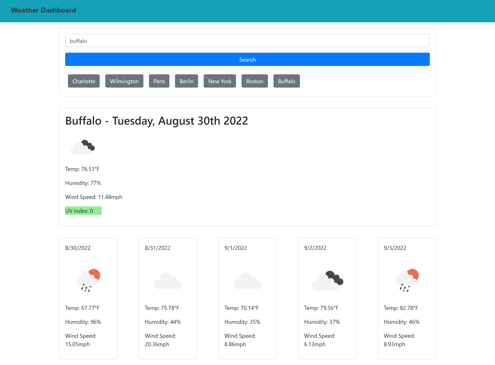

# Weather Dashboard

## Table of Content
1. [Description](#description)
2. [Visuals](#visuals)
3. [Credits](#credits)

## Description
[Weather Dashboard](https://christian-hoffman.github.io/weather-dashboard/)
 
The Weather Dashboard was created in order to allow a user to input any city name and receive the current days weather\
(temp, humidity, wind speed, uv index)\
 
The user also is provided with a 5 day forecast to upcoming days.\
That forecast includes:\
(temp, humidity, and wind speed)\
 
The users previous cities searched will be stored for easy access should they want to search it again.

## Visuals

## Credits
Christian Hoffman